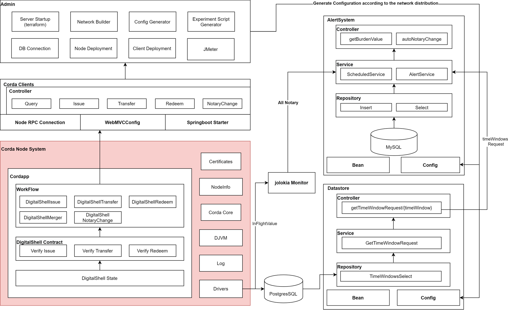
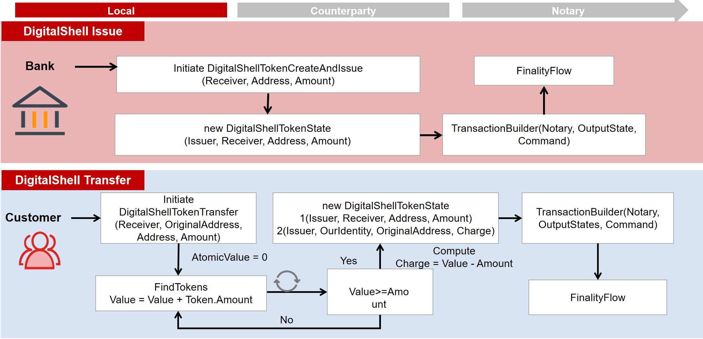

# DigitalShell Project

DigitalShell is a CBDC project for providing basic currency functionalities, such as create, issue, transfer and redeem. The project is built on the Corda framework and proposes CBDC-targeted improvements. 

Performance: 
1. The project provides Sharding services in terms of notary node.
2. We slightly change the database configuration to improve search efficiency for wallets.

### Installation
---
We encourage installing this project by directly cloning into the local. The following command downloads the project:
```
git clone git@github.com:CBDC-IoT/DigitalShell.git
```

### Run your First Network
Now the project is downloaded, it's time to begin working with Digitalshell.

You can run deployNodes in the build.gradle to generate the network and nodes. Then you can go to the project file and build/node and run runnodes.bat.

The network consists of four types of nodes: notary, canteen, service provider, bank.

- Notary: Institutions or banks which are responsible for transaction validation.
- Bank: Institutions which are responsible for money distribution.
- Service Provider: Bridges between wallets and blockchain network.
- Canteen: Corporations which make business smart contracts or provide payment interface.

####  we achieve public access (wallet) to the private network system by address in the token. Wallet: Every person will have one or many wallets containing some tokens.
Searching Wallet: We modify nodes’ database by creating a foreign key for tokens with address property to make it efficient to search tokens. After that, every transaction consumes nearly constant time and the system could provide as many tokens and wallets as need.

#### Scenario
1. Person A downloads bank’s wallet app and finishes registration. Person A uses the wallet app to initiate a request to service provider C.
2. Service provider C receives Person A’s request and initiates a transaction using the address’s tokens in the network.
3. Notary D validates the transaction.
4. Service provider E receives the transaction and updates its database.
5. Person G checks the received money in its wallet.

#### Detailed Steps: you can run the following workflows to create DigitalShell and transfer DigitalShell
```
flow start CreateDigitalShellTokenFlow amount: 10000, receiver: CustomerA, address: ABC

flow start DigitalShellTokenTransfer issuer: Bank, amount: 10, receiver: Canteen, originalAddress: ABC, address: BB
```
#### Web APIs:
```
@PostMapping(value =  "/moveToken" , consumes = APPLICATION_JSON_VALUE, produces =  TEXT_PLAIN_VALUE )
    public ResponseEntity<String> MoveCurrencyTokenFlow(@RequestBody movedToken movedToken)

@PostMapping(value="/issueToken", consumes = APPLICATION_JSON_VALUE, produces = TEXT_PLAIN_VALUE)
    public ResponseEntity<String> createCurrencyTokenFlow(@RequestBody IssuedToken issuedToken)

@PostMapping(value =  "/redeemToken" , consumes = APPLICATION_JSON_VALUE, produces = TEXT_PLAIN_VALUE )
    public ResponseEntity<String> redeemCurrencyTokenFlow(@RequestBody redeemedToken redeemedToken)

@PostMapping(value =  "/queryToken" , consumes = APPLICATION_JSON_VALUE, produces = TEXT_PLAIN_VALUE)
    public ResponseEntity<String> queryCurrencyTokenFlow(@RequestBody queriedToken queriedToken)
```

#### You can also run client service which will connect to the corda nodes and provide open APIs.
You can go to DigitalShell/clients/build.gradle to run diverse servers. You can config the connection point based on your preference.

Then you can send your request by the internet, for example,
```
http://localhost:10051/issueToken?amount=10&receiver=Canteen&address=ABC&notary=0

http://localhost:10051/moveToken?issuer=Bank&amount=10&receiver=Canteen&originalAddress=ABC&address=D
```

We now open query and transfer request APIs for the service provider node.

### How to distribute notary?
To ensure performancec need, we believe the system works the most efficiently when two same-configured notaries bear the same load. Therefore, we can monitor daily transaction workload and adjust new issuance based on transaction workload distribution.

### H2 Configuration
We slightly change the database configuration to improve search efficiency for wallets.

### Figures






### Extension

We also have Android Wallet project and Canteen Front-end and Canteen Backend page project in this organization. Please check them if you want.
