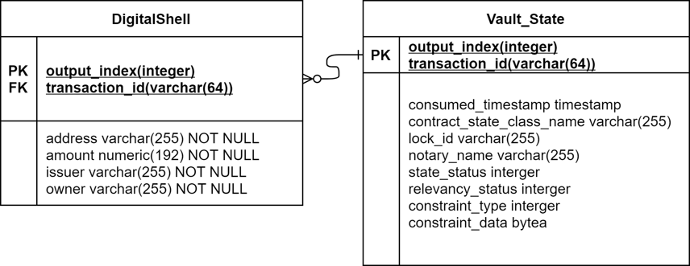

# DigitalShell Project

DigitalShell is a CBDC project for providing basic currency functionalities, such as create, issue, transfer and redeem. The project is built on the Corda framework and proposes CBDC-targeted improvements. 

Performance: 
1. The project provides Sharding services in terms of notary node.
2. We slightly change the database configuration to improve search efficiency for wallets.

### Installation
---
We encourage installing this project by directly cloning into the local. The following command downloads the project:
```
git clone git@github.com:CBDC-IoT/DigitalShell.git
```

### Run your First Network
Now the project is downloaded, it's time to begin working with Digitalshell.

You can run deployNodes in the build.gradle to generate the network and nodes. Then you can go to the project file and build/node and run runnodes.bat.

The network consists of four types of nodes: notary, canteen, service provider, bank.

#### Then you can run the following workflows to create DigitalShell and transfer DigitalShell
```
flow start CreateDigitalShellTokenFlow amount: 10000, receiver: CustomerA, address: ABC

flow start DigitalShellTokenTransfer issuer: Bank, amount: 10, receiver: Canteen, originalAddress: ABC, address: BB
```

#### You can also run client service which will connect to the corda nodes and provide open APIs.
You can go to DigitalShell/clients/build.gradle to run diverse servers. You can config the connection point based on your preference.

Then you can send your request by the internet, for example,
```
http://localhost:10051/moveToken?issuer=Bank&amount=10&receiver=Canteen&originalAddress=ABC&address=D
```

We now open query and transfer request APIs for the service provider node.

### H2 Configuration
We slightly change the database configuration to improve search efficiency for wallets.

### Figures





### Extension

We also have Android Wallet project and Canteen Front-end and Canteen Backend page project in this organization. Please check them if you want.